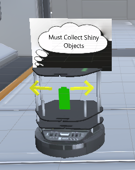

# HRI-based Augmentation  in  a  Virtual  robot  Environment  using  uNity (HAVEN)
## A modular robotics environment built in Unity Version 2018.4.23f1

The goal of this project is to provide a modular robotics environment that will allow researchers and developers to build upon and create new modules to 
fit their specific goals and needs.

## Current Modules:
### Robots:
* TurtleBot2 
	* Realistic Movement
	* Battery Level

### Visualizations:
* Path Projection (TurtleBot2)
	* How far to project is adjustable (TurtleBot2)
* Turn Signals (TurtleBot2)
* Thought Bubble (TurtleBot2)
* Battery Level (TurtleBot2)  

### Scenarios:
* Hallway Passing (TurtleBot2)
  * Playable [demo](https://simmer.io/@DreVinciGames/haven) of alternate version 
  * Current Progress: Turtlebot2 navigates through the hallways in a set pattern,
                      can detect if the human is in its line of sight. If the human makes contact 
                      with the robot the scene resets
  * WIP: Getting the robot to move to either side to avoid the human if they are in the way
* Object Retrieval (TurtleBot2)
	* Current Progress: Turtlebot2 navigates to and collects all gems in random order
	* WIP: Getting the Turtlebot2 to navigate around the human if the human obstructs its path  

